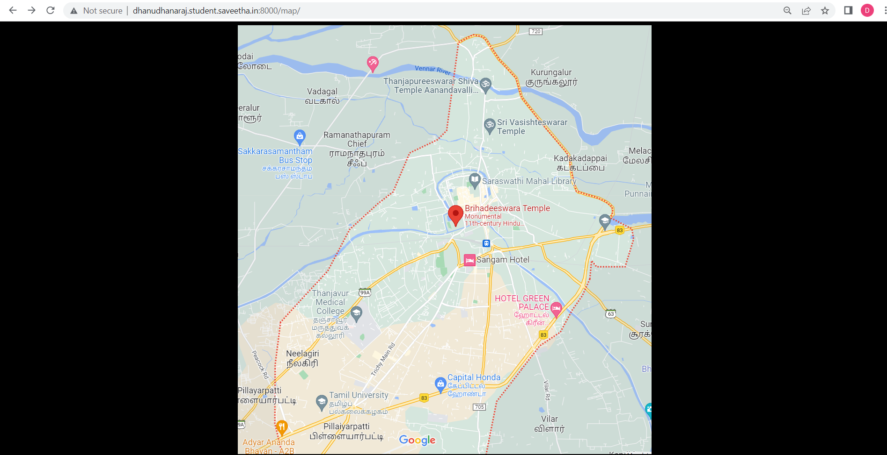
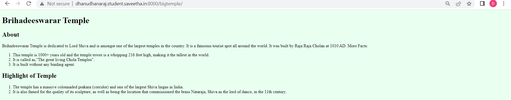
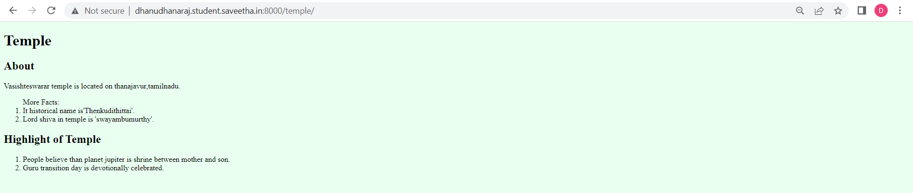
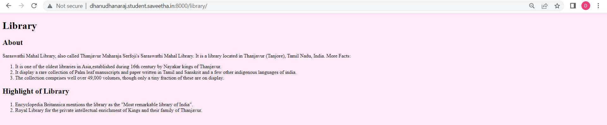
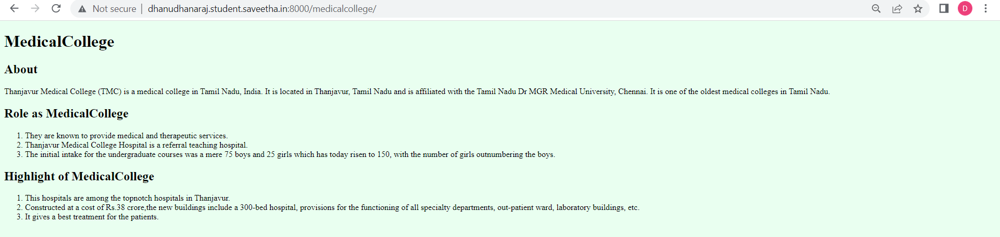
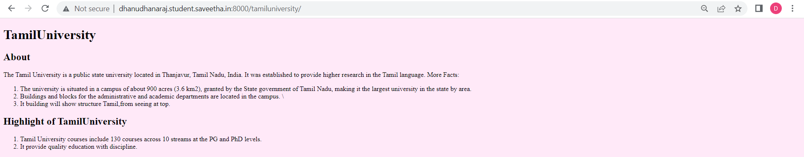
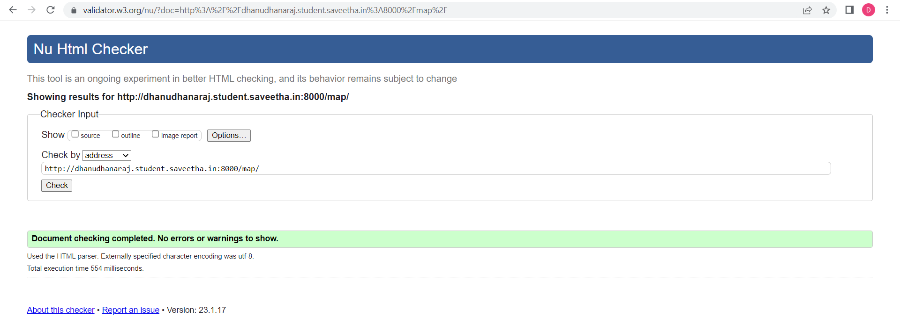

# Places Around Me
## AIM:
To develop a website to display details about the places around my house.

## Design Steps:

### Step 1:
Clone the github repository into Theia IDE.

### Step 2:
Create a new Django project.

## Step 3:
Write the needed HTML code.

## Step 4:
Run the Django server and execute the HTML files.

## Code:
```
map.html
<!DOCTYPE html>
<html lang="en">
    <head>
        <title> Thanjavur Map </title>
    </head>
    <body style="background-color:black;">
        <div style="text-align: center;">
            </div>
<MAP name= "thanjavurmap">
    <area shape="RECT" coords="465,306,626,368" alt="library" title="library" href="/library/">
    <area shape="RECT" coords="136,557,286,675" alt="medicalcollege" title="medicalcollege" href="/medicalcollege/">
    <area shape="RECT" coords="432,369,683,441" alt="bigtemple" title="bigtempley" href="/bigtemple/">
    <area shape="RECT" coords="515,193,766,265" alt="temple" title="temple" href="/temple/">
    <area shape="RECT" coords="155,776,406,848" alt="tamiluniversity" title="tamiluniversity" href="/tamiluniversity/">
</map>
    </body>
</html>

bigtemple.html
<!DOCTYPE html>
<html lang="en">
<head>
  <title> Brihadeeswarar Temple </title>
</head>
<body style="background-color: #E9FFF0;">

<h1>
Brihadeeswarar Temple</h1>


<h2>About</h2>
<p>
Brihadeeswarar Temple is dedicated to Lord Shiva and is amongst one of the largest temples in the country.
It is a famouus tourist spot all around the world.
It was built by Raja Raja Cholan at 1010 AD.

More Facts:
<ol>
<li>This temple is 1000+ years old and the temple tower is a whopping 216 feet high, making it the tallest in the world. </li>
<li>It is called as,"The great living Chola Temples". </li>
<li>It is built without any binding agent. </li>
</ol>
<h2>Highlight of Temple</h2>
<ol>
    <li>The temple has a massive colonnaded prakara (corridor) and one of the largest Shiva lingas in India.</li>
    <li>It is also famed for the quality of its sculpture, as well as being the location that commissioned the brass Nataraja, Shiva as the lord of dance, in the 11th century.</li>
</ol>
</body>
</html>

temple.html
<!DOCTYPE html>
<html lang="en">
<head>
  <title> Temple </title>
</head>
<body style="background-color: #E9FFF0;">

<h1>Temple</h1>


<h2>About</h2>
<p>Vasishteswarar temple is located on thanajavur,tamilnadu.</p>
 

<ol>More Facts:
<li>It historical name is'Thenkudithittai'. </li>
<li>Lord shiva in temple is 'swayambumurthy'. </li>
</ol>
<h2>Highlight of Temple</h2>
<ol>
    <li>People believe than planet jupiter is shrine between mother and son.</li>
    <li>Guru transition day is devotionally celebrated.</li>
</ol>
</body>
</html>

library.html
<!DOCTYPE html>
<html lang="en">
<head>
  <title> Library </title>
</head>
<body style="background-color: #FFE9F8;">

<h1>Library</h1>


<h2>About</h2>
<p>
Saraswathi Mahal Library, also called Thanjavur Maharaja Serfoji's Saraswathi Mahal Library.
It is a library located in Thanjavur (Tanjore), Tamil Nadu, India.

More Facts:
<ol>
<li>It is one of the oldest libraries in Asia,established during 16th century by Nayakar kings of Thanjavur.</li>
<li>It display a rare collection of Palm leaf manuscripts and paper written in Tamil and Sanskrit and a few other indigenous languages of india.</li>
<li>The collection comprises well over 49,000 volumes, though only a tiny fraction of these are on display.</li>
</ol>
<h2>Highlight of Library</h2>
<ol>
    <li>Encyclopedia Britannica mentions the library as the "Most remarkable library of India".</li>
    <li>Royal Library for the private intellectual enrichment of Kings and their family of Thanjavur.</li>
</ol>
</body>
</html>

medicalcollege.html
<!DOCTYPE html>
<html lang="en">
<head>
  <title> MedicalCollege </title>
</head>
<body style="background-color: #E9FFF0;">

<h1>MedicalCollege</h1>


<h2>About</h2>
<p>
Thanjavur Medical College (TMC) is a medical college in Tamil Nadu, India.
It is located in Thanjavur, Tamil Nadu and is affiliated with the Tamil Nadu Dr MGR Medical University, Chennai.
It is one of the oldest medical colleges in Tamil Nadu.
</p>
<h2>Role as MedicalCollege</h2>
<ol>
    <li>They are known to provide medical and therapeutic services.</li>
    <li>Thanjavur Medical College Hospital is a referral teaching hospital. </li>
    <li>The initial intake for the undergraduate courses was a mere 75 boys and 25 girls which has today risen to 150, with the number of girls outnumbering the boys.</li>
</ol>
<h2>Highlight of MedicalCollege</h2>
<ol>
    <li>This hospitals are among the topnotch hospitals in Thanjavur.</li>
    <li>Constructed at a cost of Rs.38 crore,the new buildings include a 300-bed hospital, provisions for the functioning of all specialty departments, out-patient ward, laboratory buildings, etc. </li>
    <li>It gives a best treatment for the patients.</li>
</ol>
</body>
</html>

tamiluniversity.html
<!DOCTYPE html>
<html lang="en">
<head>
  <title> TamilUniversity </title>
</head>
<body style="background-color: #FFE9F8;">

<h1>TamilUniversity</h1>

<h2>About</h2>
<p>
The Tamil University is a public state university located in Thanjavur, Tamil Nadu, India.
It was established to provide higher research in the Tamil language.

More Facts:
<ol>
<li>The university is situated in a campus of about 900 acres (3.6 km2), granted by the State government of Tamil Nadu, making it the largest university in the state by area.</li>
<li>Buildings and blocks for the administrative and academic departments are located in the campus. \</li>
<li>It building will show structure Tamil,from seeing at top.</li>
</ol>
<h2>Highlight of TamilUniversity</h2>
<ol>
    <li>Tamil University courses include 130 courses across 10 streams at the PG and PhD levels.</li>
    <li>It provide quality education with discipline.</li>
</ol>
</body>
</html>
```

## Output:












## HTML Validator:




## Result:
Thus A website to display details about the places in map is successfully executed and displayed.
